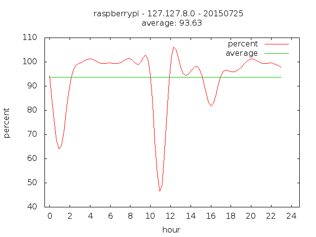
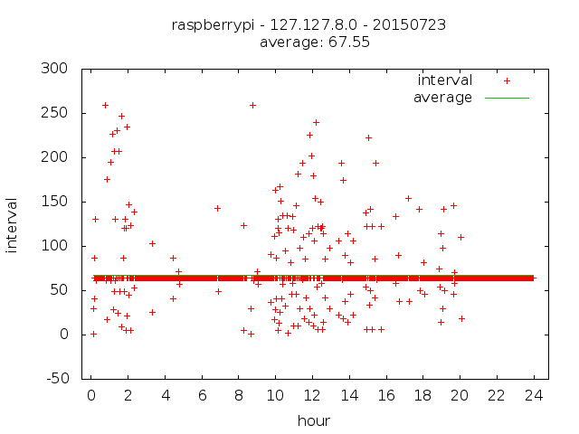
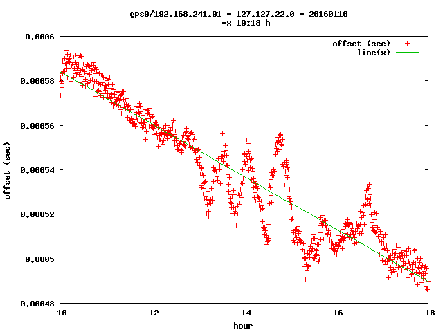

# ntpgraph

### make NTP statistic files visible 

for UNIX like systems 

ksh scripts using gawk, gnuplot and gnuplot-x11 

* ntp_shps
* ntp_shdiff
* ntptconv
* ntp_shavail

## ntp_shps 

### usage 

    # ntp_shps
     
    show NTP peerstats values as graph  - v 2016 02 09
      author: ntpgraph@ma.yer.at

    usage: ntp_shps -s|-i|-o|-d|-r|-j [ -p value ] [ -t value ] [ -m min max ] [ -c value ] [ -l ] [ -w value ] [ -x range ][ -y range ] [ -F n ] [ -L ] [ -f IMG ] IP DATE
       date is MMDD in year 2016 or YYYYMMDD or . or - ( . is today, - is yesterday  )
       -s          - success rate
       -i          - interval between updates
       -a          - print average line
       -l          - straight line instead of smooth csplines
       -f IMG      - output to file - IMG can be jpeg, png, ...
       -x range    - low:high, example 1:10.75 , default autorange -0.5:24.8
       -y range    - low:high, example -0.1:0.1 , default autorange
       -c value    - y-axis is number and not percent
       -t value    - timestemps per hour - default 1
       -p value    - poll interval used for calculation
       -w value    - line width
       -m min max  - minimum and maximum values for calculation, only for next 4 options below
       -o          - show offset - column 5
       -r          - show roundtrip delay - column 6
       -d          - show dispersion - column 7
       -j          - show rms jitter - column 8
       -F n        - fit function, n polynomial (1,2)
       -L          - label at bottom - only for fit function
       -D          - debug

### examples 

#### offset by a GPS disciplined NTP server 

###### ntp_shps -a -o -f png 127.127.28.1 0711

#### success rate for a DCF receiver 

of course it can't be more than 100%.
but there two reasons why the graph shows more than 100 % 
* 1) the reference clock is updated each 64 seconds.  
therefore an exact count of possible updates within one hour is hard to calculate
* 2) the smooth function generates an overshot. 
adding the option -l gives sometimes better results 

###### ntp_shps -a -s -f png 127.127.8.0 0725

#### interval between updates for a DCF receiver 

if all data-grams are received all intervals are 64 seconds 
this gives an indication how well the receiver performs 

###### ntp_shps -a -i -f png -y -50:300 127.127.8.0 0723

#### round-trip delay between a remote peer and the local server 

the local NTP server is connected with ADSL to the Internet 

###### ntp_shps -a -r -y 0:0.03 -f png some.ip.addr 0723 

#### using the FIT function to interpolate the measured values 

First run the command without -F option to get start values for x and y. For example for a time frame between 10 and 18 o'clock. 

ntp_shps -o -x 10:18 127.127.22.0 . 

Now move the mouse cursor over a possible start value. In my case x=10 and y=5.9e-4 

Run the same command but with option -F. I used additional option -f to generate a .PNG file in the local working directory. 

Important ! The start values must not be zero. 

###### ntp_shps -o -x 10:18 -F 10 5.9e-4 -f png  127.127.22.0 .

 

Now you get an additional ( green ) line with function: line(x) = y0 + m*x 

On error output one can directly read the value: m = -1.18075e-05

With debug option -D the fit log file "/tmp/fit.log.$$" will not be deleted. 

## ntp_shdiff 

### usage 

    # ntp_shdiff
     
    show time difference for 2 NTP server - v 2016 02 09
      author: ntpgraph@ma.yer.at

    usage: ntp_shdiff [ -a ] [ -f ] [ -l ] [ -m value ] [ -t value ] [ -y range ] [ -F n ] [ -L ] IP1 IP2 date
       date is MMDD in year 2016 or YYYYMMDD or . or - ( . is today, - is yesterday  )
       -x range   - low:high, example 1:10 , default autorange -0.5:24.8
       -y range   - low:high, example -0.1:0.1 , default autorange
       -a         - print average line
       -l         - straight line instead of smooth csplines
       -f IMG     - output to file in current working directory - IMG can be jpeg, png, ...
       -t number  - values per hour, default is 1
       -m value   - maximum time difference - default 1.1
       -F n       - fit function, n polynomial (1,2)
       -L         - label at bottom - only for fit function
       -D         - debug

### example

#### time difference between two NTP server 

###### ntp_shdiff -a -f png 127.127.28.1 some.ip.addr 0724

## ntptconv 

#### ntp time convert 

make the time stamp in various statistic files human readable 

example 

without ntptconv 

    $ cat /var/log/ntpstats/peerstats.20150725 | grep 0.001142971
    57228 86324.503 192.168.241.190 9024 0.005973466 0.001142971 0.000946181 0.000013892

with ntptconv

    $ cat /var/log/ntpstats/peerstats.20150725 | grep 0.001142971 | ntptconv
    57228 23:58:44 192.168.241.190 9024 0.005973466 0.001142971 0.000946181 0.000013892

## ntp_shavail 

### usage

    # ntp_shavail

    show NTP available peers as graph  - v 2016 02 06
      author: ntpgraph@ma.yer.at
    
    usage: ntp_shavail [ -D ] [ -f IMG ] DATE
       date is MMDD in year 2016 or YYYYMMDD or . or - ( . is today, - is yesterday  )
       -f IMG      - output to file - IMG can be jpeg, png, ...
       -D          - debug

ntp_shavail will show all available NTP server for a given day. On the Y axis one can see all server. For example server #3 ( 192.168.241.190 ) called "blitz". All it's dots are on the base line which is 3.0 - the .0 says "reject". An other example for server #4. It was most of the time a candidate (+) on line 4.4 and sometime a peer (*) on y-value 4.6  
The symbols ( x - + # o ) have the same meaning as "ntpq" shows.

ntp_shavail -f png .

